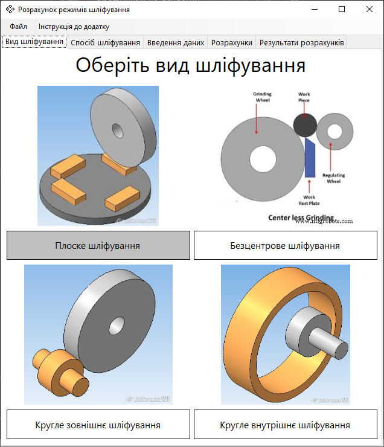
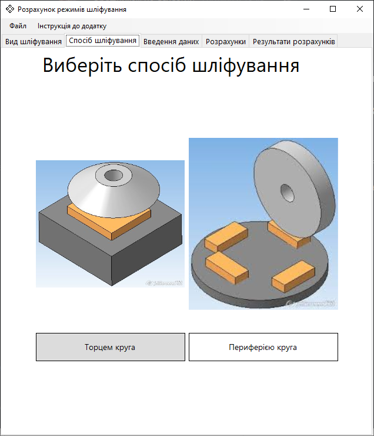
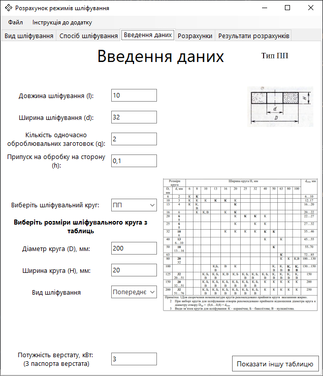
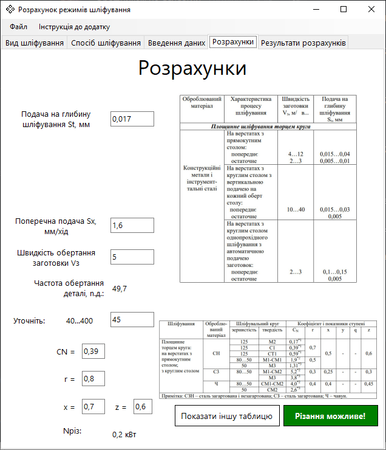
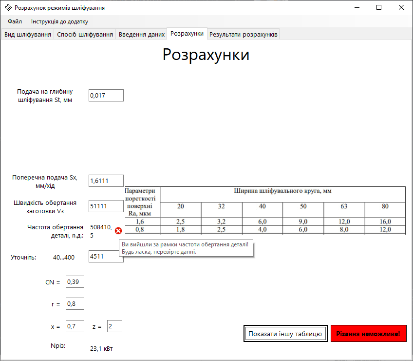
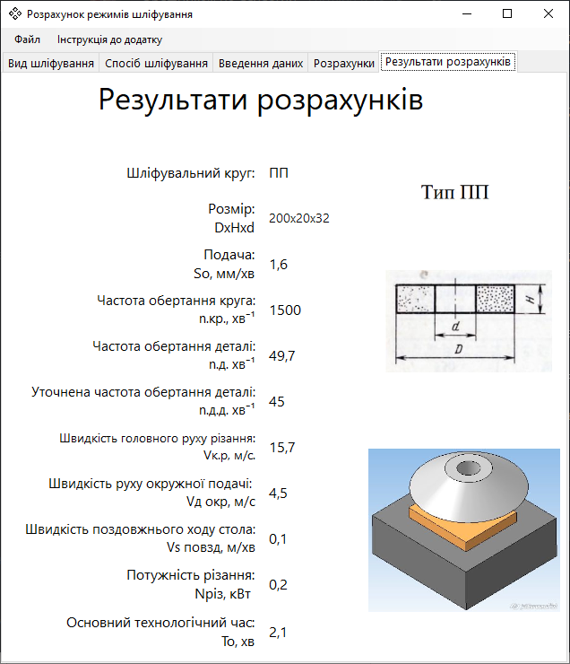
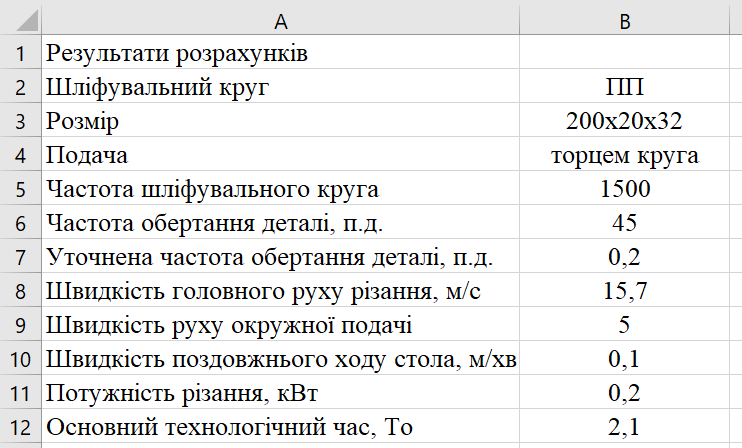
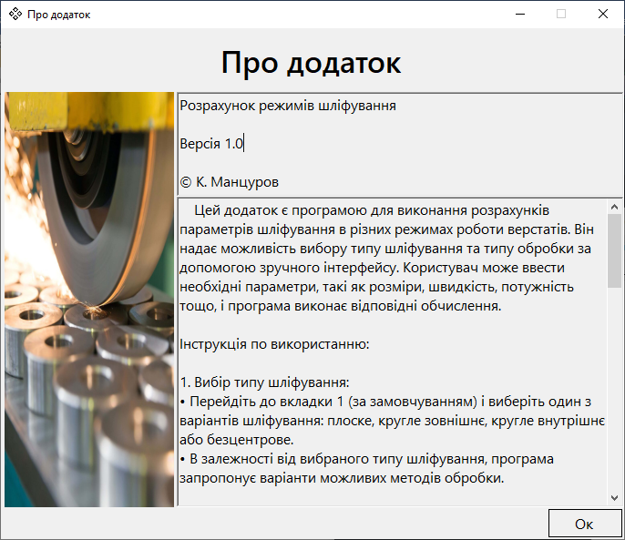

# ⚙️ Grinding Calculator – Інженерна програма автоматизації розрахунку режимів шліфування

<!--  -->

> _«Достатньо просто ввести дані – програма порахує сама.»_

Прикладне інженерне ПЗ для автоматизації високоточних розрахунків режимів шліфування матеріалів. Застосунок переводить складний масив нормативно-довідкових таблиць та понад 30 наукових формул теорії різання у швидкий покроковий алгоритм. Автоматично валідує вхідні параметри, перевіряє можливість різання та генерує підсумкові карти з можливістю експорту в MS Excel.

<b>Навіщо це?</b>

Додаток створювався на запит викладачів та інженерів-технологів навчального закладу.

Традиційний розрахунок режимів шліфування вручну – це надто тривалий та рутинний процес:

1. **Втрата часу:** Розрахунок одного тех. процесу за допомогою формул, таблиць та паспорта верстата займав у студентів та інженерів від **1.5 до 2 годин**.
2. **Людський фактор та ризики:** Найменша помилка під час вибору коефіцієнта з довідника або обчислення степеня зводила нанівець усі попередні розрахунки, змушуючи проходити весь шлях заново. А якщо помилку не помічали на папері – це створювало реальні ризики зіпсувати деталь або пошкодити обладнання при роботі за верстатом.
3. **Складність перевірки:** Викладачу доводилося вручну перераховувати кожну формулу, щоб знайти, де саме студент припустився помилки.

Вся концепція покрокового алгоритму, логіка та дизайн інтерфейсу розроблялися у тісній співпраці із замовником та були максимально узгоджені під їхні вимоги. Також було вирішено прохання легкого розповсюдження: додаток упаковано в простий інсталятор, що дозволило розгортати його на будь-якому комп'ютері.

> **Цікавий факт:** Під час тестування додаток видавав результат, який розходився прикладами. Як виявилося пізніше, програма була абсолютно права – у самій методичці, була закрадена математична помилка. Програма не помиляється.

#### 📊 Результат впровадження

- ⏳ Час отримання готової тех. карти скоротився з **120 хвилин до ~5 хвилин**.
- 🚫 Повністю виключено помилки у виразах та людський фактор.
- ✅ Продукт був успішно переданий та впроваджений у навчальний процес профільних дисциплін для студентів та викладачів.

<h3>Зміст</h3>

- [🛠️ Стек](#tech-stack)
- [📸 Галерея](#gallery)
- [🔬Задіяні формули](#formulas)

<h2 id="tech-stack">🛠️ Технологічний Стек</h2>

---

 <!-- C# -->
 <!-- .NET -->
 <!-- WinForms -->
 <!-- Visual Studio -->
 <!-- OOP -->

<h2 id="gallery">📸 Галерея</h2>

---

<small><i>Коротка демонстрація можливостей застосунку</i></small>

<small><i>Крок 1: Вибір базового виду обробки</i></small>

<small><i>Крок 2: Деталізація способу шліфування (Для кожного виду різні варіанти)</i></small>

<small><i>Крок 3: Введення геометричних та ін. параметрів за нормативними таблицями</i></small>

<small><i>Крок 4: Задання останніх параметрів та автоматична перевірка можливості різання</i></small>

<small><i>Попередження при виході параметрів за допустимі межі верстата</i></small>

<small><i>Крок 5: Сформований підсумковий екран із усіма необхідними параметрами для різання</i></small>

<small><i>Згенерований підсумковий звіт у форматі Microsoft Excel (.xlsx)</i></small>

<small><i>Вікно «Про додаток» з інформацією про версію, автора та вбудованою покроковою інструкцією користувача</i></small>

<!-- 🔬Задіяні формули -->

<h2 id="formulas">🔬Задіяні формули</h2>

---

### Вхідні дані

| Ідентифікатор | Діапазон значень    | Пояснення                                  |
| ------------- | ------------------- | ------------------------------------------ |
| -             | Типи шліфування     | Тип шліфування                             |
| -             | Способи обробки     | Спосіб шліфування                          |
| l             | 0.0 - 1000.0        | Довжина шліфування                         |
| d             | 0.0 - 1000.0        | Ширина шліфування                          |
| Q             | 0.0 - 100.0         | Кількість одночасно оброблюваних заготовок |
| h             | 0.0 - 10.0          | Припуск обробки на сторону                 |
| nкр           | 0 - 100000          | Частота обертання шліфувального круга      |
| -             | ПП, ПВ і т.д.       | Тип шліфувального круга                    |
| D             | 0.0 - 1000.0        | Діаметр шліфувального круга                |
| H             | 0.0 - 100.0         | Ширина шліфувального круга                 |
| kW            | 0.0 - 100.0         | Потужність приводу                         |
| St            | 0.0 - 1000.0        | Ширина на глибину шліфування               |
| Sp            | 0.0 - 100.0         | Радіальна подача                           |
| So            | 0.0 - 100.0         | Поздовжня подача                           |
| Sx            | 0.0 - 100.0         | Поперечна подача                           |
| -             | Ручний/Автоматичний | Тип стола верстата                         |
| -             | Попередня/Остаточна | Попередня обробка                          |
| V3            | 0 - 10000           | Швидкість обертання заготовки              |
| nd            | 0.0 - 10000.0       | Частота обертання деталі                   |
| ndd           | 0.0 - 10000.0       | Уточнена частота обертання деталі          |
| CN            | 0.0 - 100.0         | Розрахунковий параметр                     |
| r             | 0.0 - 100.0         | Розрахунковий параметр                     |
| x             | -1000.0 - 1000.0    | Розрахунковий параметр                     |
| y             | -1000.0 - 1000.0    | Розрахунковий параметр                     |
| q             | 0.0 - 1000.0        | Розрахунковий параметр                     |
| z             | 0.0 - 1000.0        | Розрахунковий параметр                     |

### Перелік формул
---

 

**Швидкість головного руху різання (обертання шліфувального круга)**

$$
V_{\text{кр}} = \frac{\pi D_{\text{кр}} n_{\text{кр}}}{1000 \cdot 60}
\tag{2.1}
$$

**Частота обертання деталі**

$$
n_{\text{д}} = \frac{1000 V_{\text{д.окр}}}{\pi d}
\tag{2.2}
$$

**Швидкість поздовжнього ходу стола**

$$
V_{S_{\text{позд}}} = \frac{n_{\text{д.д}} S_o}{1000}
\tag{2.3}
$$

**Потужність різання при шліфуванні периферією круга з поздовжньою подачею**

$$
N_{\text{різ}} =
C_N \cdot V_{\text{з.окр}}^{r}
\cdot S_t^{x}
\cdot S_o^{y}
\cdot d^{q}
\tag{2.4}
$$

**Потужність різання при шліфуванні периферією круга з радіальною подачею (врізанням)**

$$
N_{\text{різ}} =
C_N \cdot V_{\text{з.окр}}^{r}
\cdot S_p^{y}
\cdot d^{q}
\cdot b^{z}
\tag{2.5}
$$

**Потужність різання при шліфуванні торцем круга**

$$
N_{\text{різ}} =
C_N \cdot V_{\text{з.окр}}^{r}
\cdot S_t^{x}
\cdot b^{z}
\tag{2.6}
$$

**Умова допустимої потужності різання**

$$
N_{\text{різ}} \leq N_{\text{шп}}
\tag{2.7}
$$

**Потужність шпинделя**

$$
N_{\text{шп}} = N_{\text{дв}} \cdot \eta
\tag{2.8}
$$

**Основний технологічний час при зовнішньому круглому шліфуванні з поздовжньою подачею**

$$
T_o =
\frac{L_{\text{р.х}} \cdot h}
{S_o \cdot S_t \cdot n_{\text{зд}}}
\cdot K
\tag{2.9}
$$

**Довжина робочого ходу інструменту**

$$
L_{\text{р.х}} = l + 0{,}5B_{\text{кр}}
\tag{2.10}
$$

**Основний технологічний час при зовнішньому круглому та безцентровому шліфуванні з радіальною подачею (врізанням)**

$$
T_o = \frac{h}{n_{\text{д.д}} \cdot S_p} \cdot K
\tag{2.11}
$$

**Основний технологічний час при безцентровому круглому шліфуванні з поздовжньою подачею**

$$
T_o = \frac{h}{S_o \cdot S_p} \cdot K
\tag{2.12}
$$

### Розрахунок режимів різання при шліфуванні отвору і торця

**Швидкість головного руху різання (обертання шліфувального круга)**

$$
V_{\text{кр}} = \frac{\pi D_{\text{кр}} n_{\text{кр}}}{1000 \cdot 60}
\tag{2.13}
$$

**Частота обертання деталі**

$$
n_{\text{д}} = \frac{1000 \cdot V_{\text{д.окр}}}{\pi \cdot d}
\tag{2.14}
$$

**Швидкість руху колової подачі**

$$
V_{S_{\text{кол}}} = \frac{\pi d n_{\text{д.д}}}{1000}
\tag{2.1}
$$

**Швидкість руху поздовжньої подачі**

$$
V_{S_{\text{позд}}} = \frac{S_o n_{\text{д.д}}}{1000}
\tag{2.16}
$$

**Потужність різання при шліфуванні периферією круга з поздовжньою подачею**

$$
N_{\text{різ}} =
C_N \cdot V_{S_{\text{кол}}}^{r}
\cdot S_t^{x}
\cdot S_o^{y}
\cdot d^{q}
\tag{2.17}
$$

**Потужність різання при шліфуванні периферією круга з радіальною подачею**

$$
N_{\text{різ}} =
C_N \cdot V_{S_{\text{кол}}}^{r}
\cdot S^{y}
\cdot d^{q}
\cdot b^{z}
\tag{2.18}
$$

**Потужність різання при шліфуванні торцем круга**

$$
N_{\text{різ}} =
C_N \cdot V_{S_{\text{кол}}}^{r}
\cdot S_t^{x}
\cdot b^{z}
\tag{2.19}
$$

**Умова допустимої потужності різання**

$$
N_{\text{різ}} \leq N_{\text{шп}}
\tag{2.20}
$$

**Потужність шпинделя**

$$
N_{\text{шп}} = N_{\text{дв}} \cdot \eta
\tag{2.21}
$$

**Основний технологічний час при шліфуванні з поздовжньою подачею**

$$
T_o = \frac{2L_{\text{р.х}}h}{V_{S_{\text{позд}}}S_t}
\tag{2.22}
$$

**Основний технологічний час при шліфуванні з радіальною подачею (врізанням)**

$$
T_o = \frac{h}{n_{\text{д}}S_p} \cdot K
\tag{2.23}
$$

**Довжина робочого ходу інструменту**

$$
L_{\text{р.х}} = l + 0{,}5B_{\text{кр}}
\tag{2.24}
$$

### Розрахунок режимів різання при шліфуванні площини

**Швидкість шліфувального круга**

$$
V_{\text{кр}} = \frac{\pi D_{\text{кр}} n_{\text{кр}}}{1000 \cdot 60}
\tag{2.25}
$$

**Потужність різання при шліфуванні периферією круга з поздовжньою подачею**

$$
N_{\text{різ}} =
C_N \cdot V_{S_{\text{позд}}}^{r}
\cdot S_t^{x}
\cdot S_o^{y}
\cdot B_{\text{кр}}^{0{,}25}
\tag{2.26}
$$

**Потужність різання при шліфуванні торцем круга**

$$
N_{\text{різ}} =
C_N \cdot V_{S_{\text{позд}}}^{r}
\cdot S_t^{x}
\cdot B^{z}
\tag{2.27}
$$

**Умова допустимої потужності різання**

$$
N_{\text{різ}} \leq N_{\text{шп}}
\tag{2.28}
$$

**Потужність шпинделя**

$$
N_{\text{шп}} = N_{\text{дв}} \cdot \eta
\tag{2.29}
$$

**Основний технологічний час при шліфуванні з поздовжньою подачею**

$$
T_o = \frac{2L_{\text{р.х}}h}{V_{S_{\text{позд}}}S_t}
\tag{2.30}
$$

**Основний технологічний час при шліфуванні з радіальною подачею (врізанням)**

$$
T_o = \frac{HLh}{1000V_{S_{\text{позд}}}S_xS_tq} \cdot K
\tag{2.31}
$$

**Переміщення шліфувального круга в напрямку поперечної подачі**

$$
H = B_{\text{з}} + B_{\text{кр}} + 5
\tag{2.32}
$$

**Довжина поздовжнього ходу стола**

$$
L = L_{\text{з}} + 10
\tag{2.33}
$$

**Основний технологічний час при шліфуванні торцем круга**

$$
T_o = \frac{HLh}{1000V_{S_{\text{позд}}}S_xS_tq} \cdot K
\tag{2.34}
$$

